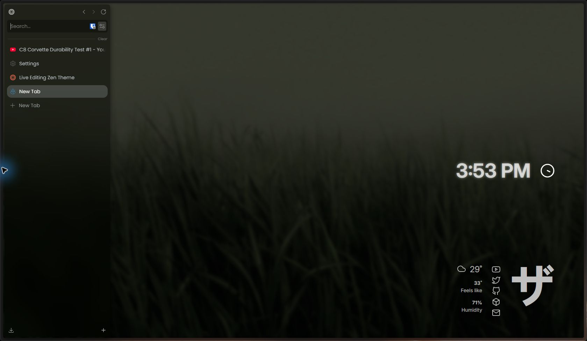
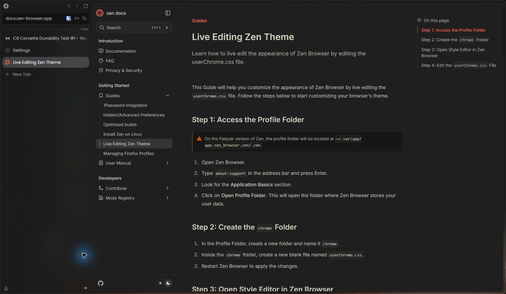
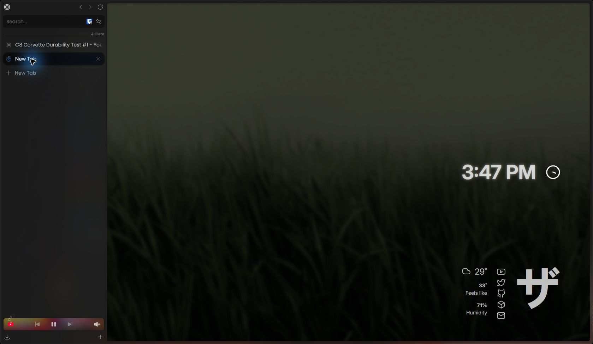
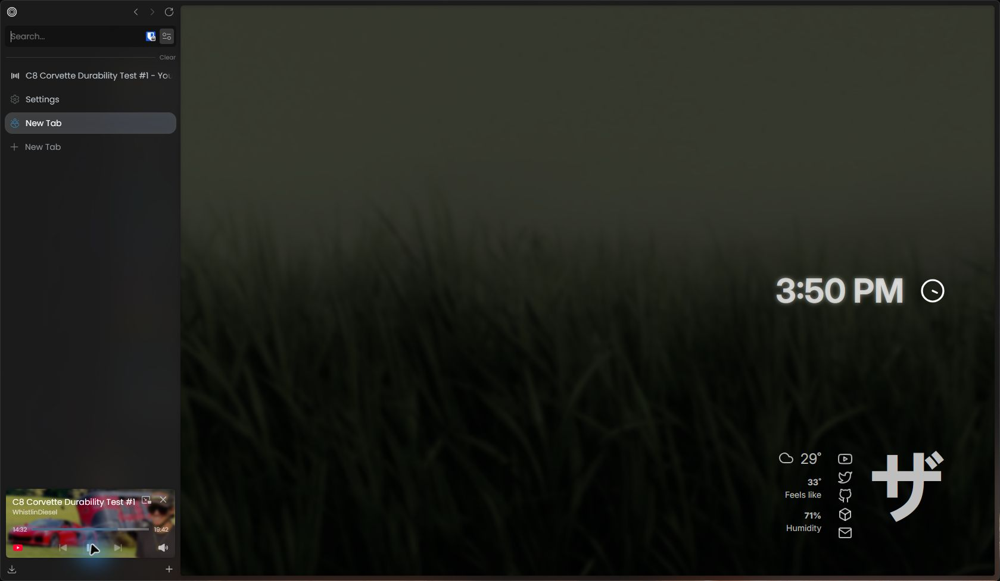

# Nebula Nova

A glass-inspired theme for [Zen Browser](https://zen-browser.app/) with a soft sidebar, compact mode, optional motion, and an artwork-backed media player. Nebula Nova is installed and configured through [Sine](https://github.com/CosmoCreeper/Sine).

## Showcase

| Browsing                                                               | Optional media artwork                                                             |
| ---------------------------------------------------------------------- | ---------------------------------------------------------------------------------- |
|  |  |

Artwork is off by default. When enabled, the media player starts with simple blur. Thumbnail style is also available:

## Install

1. Install Sine using its [setup guide](https://github.com/CosmoCreeper/Sine).
2. In Zen, open **Settings → Cosine Mods** and install **Nebula Nova** from the marketplace.
3. Open the mod's settings (gear icon) to choose the glass, animation, layout, and media options.
4. Restart Zen after installing or updating the mod so its chrome styles and script load together.

The Sine mod ID and on-disk folder are still `Nebula`, preserving existing installs and preferences after the display-name change.

## Configure

- **Nebula Glass Blur** and **Nebula Glass Saturation** control CSS blur on floating browser UI, including the compact sidebar, URL bar, find bar, and media player. Enter a CSS length such as `32px` for blur.
- **Show artwork behind the media player** is off by default. When enabled, **Media Player Background Style** starts with **Simple blur** for a diffuse background; **Thumbnail** shows a more recognizable image. Changes apply to an open media card without restarting Zen.
- The other Sine controls adjust tab motion, hover glow, typography, colors, and layout. The preference defaults are in [`preferences.json`](preferences.json), with CSS fallbacks in [`nebula/config.css`](nebula/config.css).

For manual CSS changes, see [Zen's live editing guide](https://docs.zen-browser.app/guides/live-editing).

In noncompact mode, the sidebar sits beside the page, so browser CSS cannot blur the page through it. The glass setting still affects floating UI. Blurring the desktop behind a transparent Zen window depends on the operating system compositor:

- **Windows 11:** [Mica For Everyone](https://github.com/MicaForEveryone/MicaForEveryone) can apply an Acrylic backdrop to `zen.exe`.
- **KDE Plasma:** [Better Blur DX](https://github.com/xarblu/kwin-effects-better-blur-dx) can apply blur to the Zen window.
- **GNOME:** Blur My Shell's Application Blur can blur a transparent Zen window.

These compositor effects are separate from Nebula Nova's CSS blur value.

The New Tab screenshots use the user's configured start page and wallpaper. A start-page extension such as [Bonjourr](https://addons.mozilla.org/firefox/addon/bonjourr-startpage/) is optional; Nebula Nova does not install or require one.

## Credits

Inspired by [Natsumi Browser](https://github.com/greeeen-dev/natsumi-browser), [Lacuna](https://github.com/Tanay-Kar/Lacuna), [My Internet](https://github.com/sameerasw/my-internet), [Pineapple Fried](https://github.com/TheBigWazz/Pineapple-Fried), [Advanced Tab Groups](https://github.com/TFFC-Anoms12/Advanced-Tab-Groups), and [NoGaps](https://github.com/Comp-Tech-Guy/No-Gaps).

Nebula Nova is free to fork and adapt under the repository's [license](LICENSE). Please credit the project when sharing a derivative. Report reproducible issues in the repository's issue tracker.
